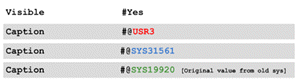

---
title: Compare Tool
TOCTitle: Compare Tool
ms:assetid: a15102de-07a8-4f85-a7f9-e17aa6e7a6f9
ms:mtpsurl: https://msdn.microsoft.com/en-us/library/Aa849010(v=AX.60)
ms:contentKeyID: 35248288
ms.date: 05/18/2015
mtps_version: v=AX.60
---

# Compare Tool 

_**Applies To:** Microsoft Dynamics AX 2012 R3, Microsoft Dynamics AX 2012 R2, Microsoft Dynamics AX 2012 Feature Pack, Microsoft Dynamics AX 2012_

In Microsoft Dynamics AX, you can compare application objects to find differences by using the **Compare** tool. After you identify the differences, you can insert, delete, or move the differences between the compared application object. This topic describes how to interpret the results of the comparison.

The **Compare** tool enables you to compare:

  - Two different application objects.

  - The same application object in two different layers.

  - Two versions of the same application object, if you are using version control.

  - Two versions of the same application object and the original version of the application object.

  - Two SSRS report designs, in cumulative update 7 for Microsoft Dynamics AX 2012 R2.

## Interpreting Compare Tool Results

After you run a comparison, the differences between the application objects are displayed in the **Comparison** form.

The following table describes the symbols and colors that are used to show differences between objects.

<table>
<colgroup>
<col style="width: 33%" />
<col style="width: 33%" />
<col style="width: 33%" />
</colgroup>
<thead>
<tr class="header">
<th>
Symbol or color
</th>
<th>
Description
</th>
<th>
Example
</th>
</tr>
</thead>
<tbody>
<tr class="odd">
<td>
Shaded check box that has a black check mark
</td>
<td>
There are differences in one or more child nodes.
</td>
<td></td>
</tr>
<tr class="even">
<td>
Check box that has a black check mark.
</td>
<td>
There are no differences in this node. This symbol is only displayed when the <strong>Show differences only</strong> option is cleared.
</td>
<td></td>
</tr>
<tr class="odd">
<td>
Red and blue unequal icon
</td>
<td>
There are differences in the current node.
</td>
<td></td>
</tr>
<tr class="even">
<td>
Black text
</td>
<td>
There is no difference between the two objects for this text.
</td>
<td></td>
</tr>
<tr class="odd">
<td>
Red or blue check marks
</td>
<td>
The check mark specifies differences that belong to only one object, and the red or blue color identifies which object that the difference belongs to.
</td>
<td>

or

</td>
</tr>
<tr class="even">
<td>
Red or blue text on a shaded background
</td>
<td>
The shaded background specifies the differences, and the red or blue color identifies which object that the difference belongs to.
</td>
<td></td>
</tr>
<tr class="odd">
<td>
Green text on a shaded background
</td>
<td>
The shaded background specifies the differences, and the green color identifies a difference between the original object and the two compared objects.
</td>
<td></td>
</tr>
<tr class="even">
<td>
Action arrow that points right
</td>
<td>
The difference is inserted into the object.
</td>
<td></td>
</tr>
<tr class="odd">
<td>
Action arrow that points left
</td>
<td>
The difference is deleted from the object.
</td>
<td></td>
</tr>
<tr class="even">
<td>
Action arrow curved
</td>
<td>
The difference is moved to this location in the object.
</td>
<td>

or

</td>
</tr>
</tbody>
</table>

The following figure shows the differences between the AddressWizard class and the AddressWizardAustralia class.

.gif "Comparison Form")

**Differences between AddressWizard and AddressWizardAustralia**

## Changing the Code

Code differences between two objects may have an action arrow icon located to the left of the difference in the **Comparison** form results window. Click the appropriate action arrow icon to insert, delete, or move code.

> [!NOTE]
> 
You can only edit code from the current layer.

## See also

[How to: Compare Two Application Objects](how-to-compare-two-application-objects.md)

[How to: Compare Layers](how-to-compare-layers.md)

[How to: Compare Versions of an Object](how-to-compare-versions-of-an-object.md)

  
**Announcements:** New book: "Inside Microsoft Dynamics AX 2012 R3" now available. Get your copy at the [MS Press Store](https://www.microsoftpressstore.com/store/inside-microsoft-dynamics-ax-2012-r3-9780735685109).

