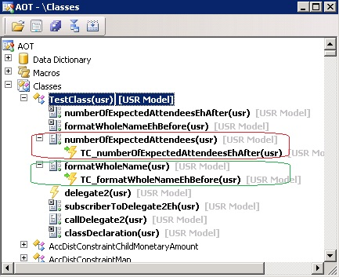

---
title: 'How to: Modify Parameter Values in a Pre-Method Event Handler'
TOCTitle: 'How to: Modify Parameter Values in a Pre-Method Event Handler'
ms:assetid: 88242a6b-6bdc-41fc-83a2-56570d074064
ms:mtpsurl: https://msdn.microsoft.com/en-us/library/Gg862568(v=AX.60)
ms:contentKeyID: 35246231
ms.date: 05/18/2015
mtps_version: v=AX.60
---

# How to: Modify Parameter Values in a Pre-Method Event Handler 


_**Applies To:** Microsoft Dynamics AX 2012 R3, Microsoft Dynamics AX 2012 R2, Microsoft Dynamics AX 2012 Feature Pack, Microsoft Dynamics AX 2012_

In Microsoft Dynamics AX, you can assign a static method to be an event handler that starts and ends immediately before a specific method on a class ends. This is called a before-method event handler, or a pre-method event handler. In the AOT you assign the event handler as a node under the method node. The **CalledWhen** property on the event handler node must be set to **Pre**.

The before-method event handler can modify the parameter values passed by the caller method, before the called method receives them.

For more information, see [Event Handler Nodes in the AOT](event-handler-nodes-in-the-aot.md).

## The AOT Elements

The following table displays the AOT elements that work together to process the event.


<table>
<colgroup>
<col style="width: 50%" />
<col style="width: 50%" />
</colgroup>
<thead>
<tr class="header">
<th><p>AOT element type</p></th>
<th><p>X++ Code sample</p></th>
</tr>
</thead>
<tbody>
<tr class="odd">
<td><p>Plain method: as a method on the TestClass class.</p></td>
<td>

```X++
// Called by the job later in this example.
public str formatWholeName
        (str _firstName, str _lastName)
{
    return _lastName + ', ' + _firstName;
}
```

</td>
</tr>
<tr class="even">
<td><p>Event handler: static method on a class.</p></td>
<td>

```X++
// CalledWhen = Pre.
static public void formatWholeNameEhBefore(XppPrePostArgs ppArgs)
{
    str firstName;
    //
    firstName = ppArgs.getArg('_firstName');
    if ('Dave' == firstName)
    {
        ppArgs.setArg('_firstName', 'David');
    }
    else if ('Bill' == firstName)
    {
        ppArgs.setArg('_firstName', 'William');
    }
}
```

</td>
</tr>
<tr class="odd">
<td><p>Node relationship in the AOT.</p></td>
<td><p>In the following image, notice that the <strong>formatWholeName</strong> method node has a child node for the <strong>TestClass::formatWholeNameEhBefore</strong> event handler.</p>

<p><strong>AOT nodes for a method and its event handler</strong></p></td>
</tr>
<tr class="even">
<td><p>Job: to run the simple method.</p></td>
<td>

```X++
static void Job1NameEhBefore(Args _args)
{
    TestClass testClass9;
    str formattedWholeName;
    //
    testClass9 = new TestClass();
    // Run a method that has a pre-method event handler,
    // one that starts and ends before the method starts.
    formattedWholeName = testClass9.formatWholeName
        ('Dave', 'Ahs');
    // The Infolog displays the effect of the before-method event handler.
    info(strFmt
        ('%1 == the formatted formal name.',
        formattedWholeName));
}
/*** Output displayed in the Infolog:
Ahs, David == the formatted formal name.
***/
```

</td>
</tr>
</tbody>
</table>


## See also

[How to: Modify the Return Value in an Post-Method Event Handler](how-to-modify-the-return-value-in-an-post-method-event-handler.md)

[Event Handler Nodes in the AOT](event-handler-nodes-in-the-aot.md)

  
**Announcements:** New book: "Inside Microsoft Dynamics AX 2012 R3" now available. Get your copy at the [MS Press Store](https://www.microsoftpressstore.com/store/inside-microsoft-dynamics-ax-2012-r3-9780735685109).

