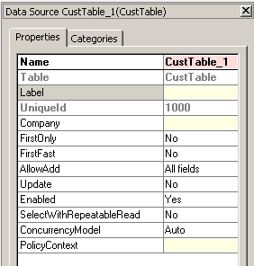
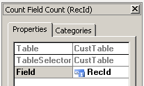
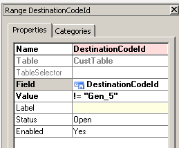
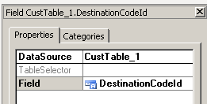
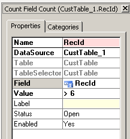
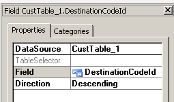

---
title: 'Walkthrough: Creating an AOT Query that has Group By and Having Nodes'
TOCTitle: 'Walkthrough: Creating an AOT Query that has Group By and Having Nodes'
ms:assetid: b57c30a1-8ee8-43dc-a472-c5854df6ff3c
ms:mtpsurl: https://msdn.microsoft.com/en-us/library/Hh745337(v=AX.60)
ms:contentKeyID: 42607687
ms.date: 05/18/2015
mtps_version: v=AX.60
dev_langs:
- sql
---

# Walkthrough: Creating an AOT Query that has Group By and Having Nodes 


_**Applies To:** Microsoft Dynamics AX 2012 R3, Microsoft Dynamics AX 2012 R2, Microsoft Dynamics AX 2012 Feature Pack, Microsoft Dynamics AX 2012_

In this walkthrough you create **Group By** and **Having** nodes under a query in the Application Object Tree (AOT).

The query you create shows the number of customer records for each destination code where there are more than six customers and the destination code is not equal to Gen\_5. If the query you create was represented in standard ANSI SQL, the select query would look like the following:

``` sql
select
        ct.DestinationCodeId
       ,count(*)
    from
        CustTable as ct
    where
        ct.DestinationCodeId != 'Gen_5'
    group by
        ct.DestinationCodeId
    having
        count(*) > 6
    order by
        1;
```


> [!NOTE]
> <P>In the example of this topic the query has its <STRONG>AllowCrossCompany</STRONG> property set to <STRONG>Yes</STRONG>. This setting means the query does no filtering on company or party.</P>


## Create the Query Entry

You create the query in the AOT by the following steps:

1.  Expand **AOT** \> **Queries**.

2.  Right-click the **Queries** node, and then click **New Query**.

3.  In the **Properties** window, edit the **Name** property value to be **QryGbyHavgRange23**.

4.  Set the **AllowCrossCompany** property to **Yes**.

5.  Right-click your **QryGbyHavgRange23** node, and then click **Save** to confirm the node and property changes.

6.  Expand the node for your new query, so that you can see its subnodes including its **Data Sources** subnode.

7.  Proceed to create the subnodes that are described in the table that follows.

## Add a Data Source

Next you must add a data source node to your query.

<table>
<colgroup>
<col style="width: 33%" />
<col style="width: 33%" />
<col style="width: 33%" />
</colgroup>
<thead>
<tr class="header">
<th><p>Subnode</p></th>
<th><p>Steps</p></th>
<th><p>Properties window</p></th>
</tr>
</thead>
<tbody>
<tr class="odd">
<td><p><strong>Data Sources</strong></p></td>
<td><p>Add the <strong>CustTable</strong> as a data source.</p>
<ol>
<li><p>Right-click <strong>Data Sources</strong>, and then click <strong>New Data Source</strong>.<br />
This creates a new node under <strong>Data Sources</strong>.</p></li>
<li><p>Click the new data source node to highlight it.</p></li>
<li><p>In the <strong>Properties</strong> window, set the <strong>Table</strong> property to <strong>CustTable</strong>. This action also changes the value of the <strong>Name</strong> property.</p></li>
</ol>
<p>This query reads data from only one table, the <strong>CustTable</strong> table.</p></td>
<td></td>
</tr>
</tbody>
</table>


## Add Subnodes Under Data Sources

The following table shows the steps to create each subnode under  
 **AOT** \> **Queries** \> **QryGbyHavgRange23** \> **Data Sources**. The table also shows the **Properties** window for each subnode.

<table>
<colgroup>
<col style="width: 33%" />
<col style="width: 33%" />
<col style="width: 33%" />
</colgroup>
<thead>
<tr class="header">
<th><p>Subnode</p></th>
<th><p>Steps</p></th>
<th><p>Properties window</p></th>
</tr>
</thead>
<tbody>
<tr class="odd">
<td><p><strong>Fields</strong></p></td>
<td><p>Add a field under the new <strong>CustTable</strong> data source node.</p>
<ol>
<li><p>Expand the new data source node.</p></li>
<li><p>Right-click the <strong>Fields</strong> node, and then click <strong>New</strong> &gt; <strong>COUNT</strong>.</p></li>
<li><p>In the Properties window for the new field node, set the <strong>Field</strong> property to <strong>RecId</strong>.</p></li>
</ol>
<p>ANSI SQL typically uses an asterisk for the count aggregate function. But in Microsoft Dynamics AX a field must be used, and by convention the <strong>RecId</strong> field is usually used.</p></td>
<td></td>
</tr>
<tr class="even">
<td><p><strong>Ranges</strong></p></td>
<td><p>Add a range node to exclude one particular value of the <strong>DestinationCodeId</strong> field. Each range node applies to the <strong>Where</strong> clause of the SQL <strong>Select</strong> statement that is eventually generated.</p>
<ol>
<li><p>Right-click the <strong>Ranges</strong> node, and then click <strong>New Range</strong>.</p></li>
<li><p>Set the Field property to <strong>DestinationCodeId</strong>.</p></li>
<li><p>Set the Value property to <strong>!= &quot;Gen_5&quot;</strong>.</p></li>
</ol>
<p>Notice that the <strong>Value</strong> property is set to both a comparison operator and a specific data value. Inclusion of an operator is optional.</p></td>
<td></td>
</tr>
<tr class="odd">
<td><p><strong>Group By</strong></p></td>
<td><p>Add a <strong>Group By</strong> clause. A query cannot have a <strong>Having</strong> clause unless it also has a <strong>Group By</strong> clause.</p>
<p>For each unique value in the <strong>DestinationCodeId</strong> field, the query counts all the <strong>CustTable</strong> records that share the same <strong>DestinationCodeId</strong> value with each other. This is accomplished by adding a group by clause.</p>
<ol>
<li><p>Right-click the <strong>Group By</strong> node, and then click <strong>New Field</strong>.</p></li>
<li><p>In the <strong>Properties</strong> window, set the <strong>Field</strong> property to <strong>DestinationCodeId</strong>.</p></li>
</ol>
<p>Implicitly the system adds the group by field to the fields list at run time, so that the group by field is also returned when the query is run.</p></td>
<td></td>
</tr>
<tr class="even">
<td><p><strong>Having</strong></p></td>
<td><p>Add a <strong>Having</strong> clause to filter the aggregate values that are generated by the <strong>Group By</strong> clause. In the present example, the <strong>COUNT(RecId)</strong> field contains the aggregate values that are filtered.</p>
<ol>
<li><p>Right-click the <strong>Having</strong> node, and then click <strong>New</strong> &gt; <strong>COUNT</strong>.</p></li>
<li><p>In the <strong>Properties</strong> window, set the <strong>Field</strong> property to <strong>RecId</strong>.</p></li>
<li><p>Set the <strong>Value</strong> property to <strong>&gt; 6</strong>.</p></li>
</ol>
<p>The value filter is compared against the <strong>COUNT</strong> aggregate result of each record that otherwise can be returned. The value is not compared against the <strong>RecId</strong> field.</p></td>
<td></td>
</tr>
<tr class="odd">
<td><p><strong>Order By</strong></p></td>
<td><p>Add an <strong>Order By</strong> node. The order by clause operates on the records that remain after all the filtering is completed.</p>
<ol>
<li><p>Right-click the <strong>Order By</strong> node, and then click <strong>New Field</strong>.</p></li>
<li><p>In the <strong>Properties</strong> window, set the <strong>Field</strong> property to <strong>DestinationCodeId</strong>.</p></li>
<li><p>Set the <strong>Direction</strong> property to <strong>Descending</strong>.</p></li>
<li><p>Right-click the <strong>QryGbyHavgRange23</strong> node, and then click <strong>Save</strong>.</p></li>
</ol></td>
<td></td>
</tr>
</tbody>
</table>


Next is an image of how the finished query looks when it is fully expanded in the AOT:

.png "The query expanded in the AOT")

   


> [!NOTE]
> <P>The preceding screen images were taken from an installation of Microsoft Dynamics AX 2012.</P>


## X++ Code to Run the Query

You can use the following X++ code to run the AOT query created in the previous procedure. The code is an X++ job that you can paste into a new job under **AOT** \> **Jobs**.

   ```X++
    static void QryGbyHavgRange23Job(Args _args)  // X++ job.
    {
        CustTable ct;
        Query q = new Query(queryStr(QryGbyHavgRange23));
        QueryRun qr = new QueryRun(q);
    
        while(qr.next())
        {
            ct = qr.get(tableNum(CustTable), 1);
            info(strFmt("(Q23)  ,  %1  ,  %2",
                    ct.DestinationCodeId, ct.RecId));
        }
        info("Done.");
    }
    /*** Infolog display of results:
    Message (04:11:40 pm)
    (Q23)  ,  Gen_9  ,  8
    (Q23)  ,  Gen_8  ,  11
    (Q23)  ,  Gen_7  ,  10
    (Q23)  ,  Gen_4  ,  15
    (Q23)  ,  Gen_3  ,  8
    (Q23)  ,  Gen_2  ,  21
    (Q23)  ,    ,  26
    Done.
    ***/
   ```

## See also

[Queries in the AOT for Data Access](queries-in-the-aot-for-data-access.md)

  
**Announcements:** New book: "Inside Microsoft Dynamics AX 2012 R3" now available. Get your copy at the [MS Press Store](https://www.microsoftpressstore.com/store/inside-microsoft-dynamics-ax-2012-r3-9780735685109).

