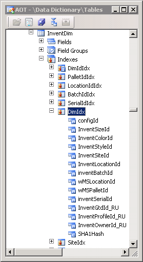

---
title: 'Walkthrough: More than 14 InventDim Dimensions Despite Index Limit'
TOCTitle: 'Walkthrough: More than 14 InventDim Dimensions Despite Index Limit'
ms:assetid: 727b5c3d-792e-43c8-b71d-e23d098a2b3c
ms:mtpsurl: https://msdn.microsoft.com/en-us/library/Dn495386(v=AX.60)
ms:contentKeyID: 60570310
ms.date: 05/18/2015
mtps_version: v=AX.60
---

# Walkthrough: More than 14 InventDim Dimensions Despite Index Limit [AX 2012]


_**Applies To:** Microsoft Dynamics AX 2012 R3, Microsoft Dynamics AX 2012 R2_

This article concerns the InventDim table. It describes how you can overcome the limit of 14 dimension fields on your inventory items. The following solution shows that, for each record, the values of all extra dimension fields can be combined into one hash value that is stored in one hash field. The hash field is included as the last field in the InventDim.DimIdx table index.

This article uses the terms of primary versus secondary dimensions. Conceptually a primary dimension is more important to your business than a secondary dimension. In the technical implementation, the field for a primary dimension is directly included in the DimIdx index. The field value for a secondary dimension is an input into the hashing algorithm that computes the value for a hash field. The hash field is the last field in the DimIdx index. The field for a secondary dimension is not in DimIdx in any other way.

The solution that is described here first became available in Microsoft Dynamics AX 2012 R2.

## Elements in the Solution

The following table describes the elements that work together to create the solution. The elements include AOT items such as indexes, fields, methods, and more.

After the following table, the subsequent section explains the steps you can follow to implement the solution for your own extra dimensions. The steps show how the elements of the solution work together.


<table>
<colgroup>
<col style="width: 33%" />
<col style="width: 33%" />
<col style="width: 33%" />
</colgroup>
<thead>
<tr class="header">
<th><p>Element name</p></th>
<th><p>Element type</p></th>
<th><p>Description</p></th>
</tr>
</thead>
<tbody>
<tr class="odd">
<td><p>InventDim</p></td>
<td><p>Table</p></td>
<td><p>The InventDim table contains values for inventory dimensions. All dimension fields must be represented in the DimIdx index, which is a unique index. Only the primary key field, named inventDimId, is excluded from DimIdx.</p>
<p>Some dimension fields are represented in DimIdx in the usual direct manner. However, if there are more than 14 dimension fields, those of secondary importance are represented in the SHA1Hash field. Multiple secondary dimensions can be represented in the single SHA1Hash field.</p>
<p>The SHA1Hash field is included in the DimIdx index.</p></td>
</tr>
<tr class="even">
<td><p>DimIdx</p></td>
<td><p>Table index</p></td>
<td><p>Here are two views of the dimensions index on the InventDim table. This index forbids duplicate values. The underlying SQL Server index is limited to a maximum of 16 fields. The field SHA1Hash is included in DimIdx, as the last field in the index.</p>
<div class="caption">
</div>
<div class="tableSection">
<div class="mtps-table">
<div class="mtps-row">
<div class="mtps-cell">
DimIdx when viewed with the AOT:  <strong>SHA1Hash is the last field inthe InventDim.DimIdx index.</strong>
</div>
<div class="mtps-cell">
DimIdx when viewed as the underlying T-SQL. Notice the two additional fields at the start, namely PARTITION and DATAAREAID:
<pre><code>CREATE UNIQUE NONCLUSTERED INDEX
 [I_698DIMIDX] ON [dbo].[INVENTDIM]
(
 [PARTITION]        ,[DATAAREAID]
,[CONFIGID]         ,[INVENTSIZEID]
,[INVENTCOLORID]    ,[INVENTSTYLEID]
,[INVENTSITEID]     ,[INVENTLOCATIONID]
,[INVENTBATCHID]    ,[WMSLOCATIONID]
,[WMSPALLETID]      ,[INVENTSERIALID]
,[INVENTGTDID_RU]   ,[INVENTPROFILEID_RU]
,[INVENTOWNERID_RU] ,[SHA1HASH]
)   WITH ...   -- (AX 2012 R2)</code></pre>
</div>
</div>
</div>
</div></td>
</tr>
<tr class="odd">
<td><p>Sha1HashCode</p></td>
<td><p>System data type</p></td>
<td><p>The type that represents a hash value in the AX system. This type can be used for a table field, or for a variable in a method, and so on just as any other type can be used.</p>
<p>The extended data type (EDT) named InventDimSHA1Hash, in its <strong>Extends</strong> property, references this system data type.</p>
<p>For more information see <strong>AOT</strong> &gt; <strong>System Documentation</strong> &gt; <strong>Types</strong>.</p></td>
</tr>
<tr class="even">
<td><p>InventDimSHA1Hash</p></td>
<td><p>Extended data type (EDT)</p></td>
<td><p>A type that extends the system data type named Sha1HashCode.</p>
<p>On the InventDim table, the hash field named SHA1Hash is of this type.</p>
<p>For more information, see <strong>AOT</strong> &gt; <strong>Data Dictionary</strong> &gt; <strong>Extended Data Types</strong>.</p></td>
</tr>
<tr class="odd">
<td><p>SHA1Hash</p></td>
<td><p>Table field</p></td>
<td><p>A field on the InventDim table, of type InventDimSHA1Hash.</p>
<p>This field stores the hashed values of additional InventDim fields above the 14 field limit. The hashValue method computes the value that is then stored in the SHA1Hash field.</p></td>
</tr>
<tr class="even">
<td><p>hashKey</p></td>
<td><p>Table method</p></td>
<td><p>A method on the InventDim table.</p>
<p>This method is called by the hashValue method. The hashKey method returns a string containing the values of the additional InventDim fields above the 14 field limit.</p>
<p>Partners whose customizations need more than 14 dimensions in the InventDim table must edit this method to add their new field names. The edit must be similar to the following X++ code which shows a pretend dimension field named FluffinessQuotientId. The field is added near the end of the hashKey method:</p>

```X++
public str hashKey()   // X++, method on InventDim table.
{
    str     hashKey = &#39;&#39;;
    #InventDimDevelop
    /** (Large comment removed for brevity.)
    ... using the code pattern below for each field
    included in the hash.
    if (this.&lt;FieldName&gt;)
    {
        hashKey += (hashKey ? &#39;~&#39; : &#39;&#39;)
            + &#39;&lt;FieldName&gt;:&#39; + this.&lt;FieldName&gt;;
    }
    **/
    // Due to index limitations, hash the value of
    // the PRETEND EXAMPLE extra &quot;dimension field&quot;.
    //
    if (this.FluffinessQuotientId)
    {
        hashKey += (hashKey ? &#39;~&#39; : &#39;&#39;)
            + &#39;FluffinessQuotientId:&#39; + this.FluffinessQuotientId;
    }
    return hashKey;
}
```
</td>
</tr>
<tr class="odd">
<td><p>hashValue</p></td>
<td><p>Table method</p></td>
<td><p>A method on the InventDim table.</p>
<p>This method is called by the insert and update methods.</p>
<p>This method calls the hashKey method.</p>
<p>The value returned by this method is very likely to be unique for any given set of unique inputs. The value is stored in the SHA1Hash field.</p></td>
</tr>
<tr class="even">
<td><p>insert</p></td>
<td><p>Table method</p></td>
<td><p>A method that is inherited by each table, and which is overridden on the InventDim table.</p>
<p>This method calls the hashValue method, and then stores the result in the SAH1Hash field.</p></td>
</tr>
<tr class="odd">
<td><p>update</p></td>
<td><p>Table method</p></td>
<td><p>A method that is inherited by each table, and which is overridden on the InventDim table.</p>
<p>This method calls the hashValue method, and then stores the result in the SAH1Hash field.</p></td>
</tr>
<tr class="even">
<td><p>findDim</p></td>
<td><p>Table method</p></td>
<td><p>A static method on the InventDim table. The method is used to retrieve a record from the InventDim table.</p>
<p>The findDim method has been updated to use the hashing infrastructure described in this document. Therefore any new fields added to the hashed field collection are used to find matching InventDim records.</p>
<p>Whenever you modify the schema of dimension fields on the InventDim table, you must modify the findDim method to concur with the modification. Any new dimensions that you add to the hashKey, what we call secondary dimensions, have no effect on the code in the findDim method. But if you add a primary dimension field to the InventDim table, you must also add the field to both long lists of dimensions that are in the code of the findDim method. For example, in the following X++ code, the pretend dimension field named FluffinexxQuotientId has been added as a primary.</p>

```X++
client server static public InventDim findDim(
    InventDim   _inventDim,
    boolean     _forupdate = false)
{
    // &lt;GEERU&gt;
    #ISOCountryRegionCodes
    // &lt;/GEERU&gt;
    InventDim       inventDim;
    if (_forupdate)
    {
        inventDim.selectForUpdate(_forupdate);
    }
    // Fields might not have been selected on the specified
    // buffers, or might have been updated since selection
    _inventDim.checkInvalidFieldAccess(false);
    if (isConfigurationkeyEnabled(configurationKeyNum(InventDimExtensibility)))
    {
        select firstonly inventDim
        where inventDim.ConfigId            == _inventDim.ConfigId
           &amp;&amp; inventDim.InventSizeId        == _inventDim.InventSizeId
           &amp;&amp; inventDim.InventColorId       == _inventDim.InventColorId
           &amp;&amp; inventDim.InventStyleId       == _inventDim.InventStyleId
           &amp;&amp; inventDim.InventSiteId        == _inventDim.InventSiteId
           &amp;&amp; inventDim.InventLocationId    == _inventDim.InventLocationId
           &amp;&amp; inventDim.InventBatchId       == _inventDim.InventBatchId
           &amp;&amp; inventDim.wmsLocationId       == _inventDim.wmsLocationId
           &amp;&amp; inventDim.wmsPalletId         == _inventDim.wmsPalletId
           // Pretend example added primary dimension.
           &amp;&amp; inventDim.FluffinessQuotientId ==  _inventDim.FluffinessQuotientId
           &amp;&amp; inventDim.sha1Hash            == _inventDim.hashValue()
           // Needed to hit unique index cache. All dimensions should
           // be included in the where clause - also those included
           // in the hash key,
           &amp;&amp; inventDim.InventSerialId      == _inventDim.InventSerialId
           &amp;&amp; inventDim.InventGtdId_RU      == _inventDim.InventGtdId_RU
           &amp;&amp; inventDim.InventProfileId_RU  == _inventDim.InventProfileId_RU
           // Demoting InventOwnerId_RU to secondary, commenting it out.
           //&amp;&amp; inventDim.InventOwnerId_RU    == _inventDim.InventOwnerId_RU;
    }
    else
    {
        select firstonly inventDim
            where inventDim.ConfigId         == _inventDim.ConfigId
               &amp;&amp; inventDim.InventSizeId     == _inventDim.InventSizeId
               &amp;&amp; inventDim.InventColorId    == _inventDim.InventColorId
               &amp;&amp; inventDim.InventStyleId    == _inventDim.InventStyleId
               &amp;&amp; inventDim.InventSiteId     == _inventDim.InventSiteId
               &amp;&amp; inventDim.InventLocationId == _inventDim.InventLocationId
               &amp;&amp; inventDim.InventBatchId    == _inventDim.InventBatchId
               &amp;&amp; inventDim.wmsLocationId    == _inventDim.wmsLocationId
               &amp;&amp; inventDim.wmsPalletId      == _inventDim.wmsPalletId
               // Pretend example of added primary dimension.
               &amp;&amp; inventDim.FluffinessQuotientId == _inventDim.FluffinessQuotientId
               // &lt;GEERU&gt;
               &amp;&amp; inventDim.InventGtdId_RU      == _inventDim.InventGtdId_RU
               &amp;&amp; inventDim.InventProfileId_RU  == _inventDim.InventProfileId_RU
               // Demoting InventOwnerId_RU to secondary, commenting it out.
               //&amp;&amp; inventDim.InventOwnerId_RU    == _inventDim.InventOwnerId_RU
               // &lt;/GEERU&gt;
               &amp;&amp; inventDim.InventSerialId   == _inventDim.InventSerialId;
    }
    #inventDimDevelop
    return inventDim;
}
```

</td>
</tr>
</tbody>
</table>


## Steps for the Solution

First plan, then implement.

### .gif "Dn495386.collapse_all(en-us,AX.60).gif")Plan

It is simpler to add a secondary dimension. For the following steps it is assumed that you want the new dimension to be a primary dimension, and that it must displace another dimension that has been primary until now.

1.  Decide whether you want your new dimension field to be among the 14 most important, or instead one of secondary importance.  
    For this example you add a primary dimension field that you name FluffinessQuotientId.

2.  Decide which primary dimension field you are demoting to secondary.  
    For this example you demote the InventOwnerId\_RU field.

### .gif "Dn495386.collapse_all(en-us,AX.60).gif")Implement

1.  Add your new dimension field named FluffinessQuotientId to the InventDim table.

2.  Edit the InventDim.hashKey method to add another if(){} block for the secondary dimension field, which in this example is the InventOwnerId\_RU field.  
    Simply match the pattern that is documented by comments in the hashKey method. Also, the example code in the earlier table, in the row for hashKey, shows the code that you must add for the FluffinessQuotientId field.

3.  Modify the InventDim.DimIdx index to remove the dimension field InventOwnerId\_RU which you are demoting to secondary.
    
    For information about indexes in the AOT, see [How to: Create an Index](how-to-create-an-index.md).

4.  Further modify the DimIdx index to add your new primary dimension field FluffinessQuotientId.

5.  Update the InventDim::findDim method to add your new dimension FluffinessQuotientId to the select statement.  
    The necessary code is shown in the earlier table, in the row for findDim.

6.  Also in findDim, remove the InventOwnerId\_RU field. This field now affects the value returned by the hashValue method.

7.  Modify any SQL statements whose speed performance relies on the demoted field InventOwnerId\_RU being a primary field of the DimIdx index.  
       
    The cross-reference feature can tell you where a given field is referenced in X++ SQL code anywhere in your AX system. For more information, see [How to: Create the Cross-Reference System](how-to-create-the-cross-reference-system.md).  
       
    Or consider creating a new index for the secondary dimension field.

## Cautions and Considerations

  - If your system needs exactly 14 dimensions, you can consider removing the SHA1Hash field from the DimIdx index. Later if you need a total of 15 or more dimensions, you would have to add the SHA1Hash field back as the last field in the DimIdx index.

  - Any X++ SQL statements which insert or update data in the InventDim table, but which avoid the insert and update methods on the InventDim table, will corrupt the data in the computed SHA1Hash field.

  - For better performance, it might be good to add another index for each secondary dimension field. The details depend on your particular implementation.

  - No set-based SQL operations can be used for insert or update of the InventDim table. The insert and update methods on the InventDim table handle only single-record operations.

  - To see an example of a form that might display some dimension related data, view the following form:
    
          *Form:* InventJournalTable,  
          *at Menu Item:* InventJournalTableMovement,  
          *at path:* **Inventory and warehouse management** \> **Journals** \> **Item transactions** \> \*

## See also

[About inventory dimensions and dimension groups](https://msdn.microsoft.com/en-us/library/aa549043\(v=ax.60\))

[Create and maintain product dimensions](https://msdn.microsoft.com/en-us/library/aa496995\(v=ax.60\))

[InventDim Table](https://msdn.microsoft.com/en-us/library/gg934874\(v=ax.60\))

  
**Announcements:** New book: "Inside Microsoft Dynamics AX 2012 R3" now available. Get your copy at the [MS Press Store](https://www.microsoftpressstore.com/store/inside-microsoft-dynamics-ax-2012-r3-9780735685109).

